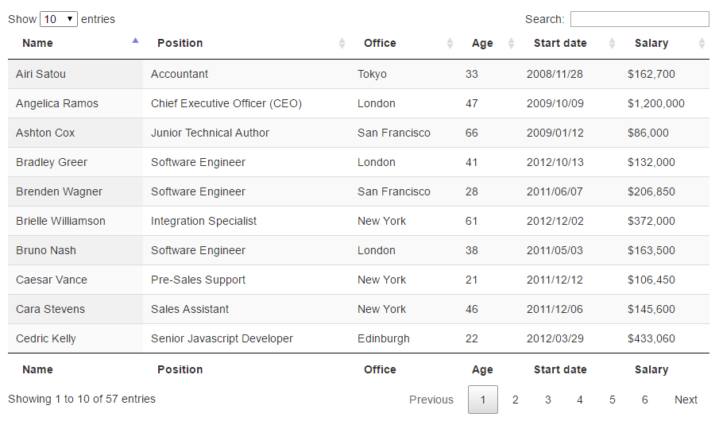
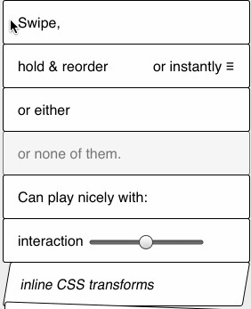

交互类
===

## DataTables

> 综合表格插件，基于jQuery开发，应用灵活，可以配合DataTables Editor形成完成的表格编辑工具。



**Official：** 
- https://datatables.net/
- https://editor.datatables.net/ （Editor）

**Features：**
- 支持分页、即时搜索、多行排序
- 支持多种形式数据源：**DOM元素**、**Javascript对象**、**ajax**、**json**，丰富的数据源选项
- 样式定制，自带样式或使用jQuery UI、Bootstrap等，可自定义
- 支持多种第三方扩展组件，自定义控件
- 可扩展的options，清晰的API
- 自定义行列功能性操作
- 快速的过滤选项开发

**Git:**
- https://github.com/DataTables/DataTables

**DEMO:**
- https://datatables.net/examples/index
- https://editor.datatables.net/examples/index

**Doc：**
- https://datatables.net/reference/index
- https://editor.datatables.net/reference/index

**Example：**
```html
<table id="example" class="display" cellspacing="0" width="100%">
        <thead>
            <tr>
                <th>First name</th>
                <th>Last name</th>
                <th>Position</th>
                <th>Office</th>
                <th>Salary</th>
            </tr>
        </thead>
        <tbody>
            <tr>
                <td>Tiger</td>
                <td>Nixon</td>
                <td>System Architect</td>
                <td>Edinburgh</td>
                <td>$320,800</td>
            </tr>
            <tr>
                <td>Garrett</td>
                <td>Winters</td>
                <td>Accountant</td>
                <td>Tokyo</td>
                <td>$170,750</td>
            </tr>
            <tr>
                <td>Ashton</td>
                <td>Cox</td>
                <td>Junior Technical Author</td>
                <td>San Francisco</td>
                <td>$86,000</td>
            </tr>
        </tbody>
    </table>
```

```javascript
$('#example').DataTable( {
	scrollY: 300,
    paging:   false,
    ordering: false,
    info:     false
} );
```

## Slip

> 通过滑动和拖动手势操作列表的UI库



**Official：** 
- https://kornel.ski/slip/

**Features：**
- 轻量
- 操作简单方便

**Git:**
- https://github.com/pornel/slip

**DEMO:**
- https://kornel.ski/slip/

**Doc：**
- https://www.awesomes.cn/repo/pornel/slip

**Example：**
```html

```

```javascript
var list = document.querySelector('ul#slippylist');
new Slip(list);

list.addEventListener('slip:beforeswipe', function(e) {
    if (shouldNotSwipe(e.target)) {
        e.preventDefault(); // won't move sideways if prevented
    }
});

list.addEventListener('slip:swipe', function(e) {
    // e.target list item swiped
    if (thatWasSwipeToRemove) {
        // list will collapse over that element
        e.target.parentNode.removeChild(e.target);
    } else {
        e.preventDefault(); // will animate back to original position
    }
});

list.addEventListener('slip:beforereorder', function(e) {
    if (shouldNotReorder(e.target)) {
        // if prevented element won't move vertically
        e.preventDefault();
    }
});

list.addEventListener('slip:beforewait', function(e) {
    if (isScrollingKnob(e.target)) {
        // if prevented element will be dragged (instead of page scrolling)
        e.preventDefault();
    }
});

list.addEventListener('slip:reorder', function(e) {
    // e.target list item reordered.
    if (reorderedOK) {
        e.target.parentNode.insertBefore(e.target, e.detail.insertBefore);
    } else {
        // element will fly back to original position
        e.preventDefault();
    }
});
```

## 

