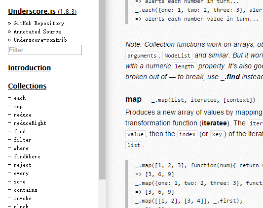
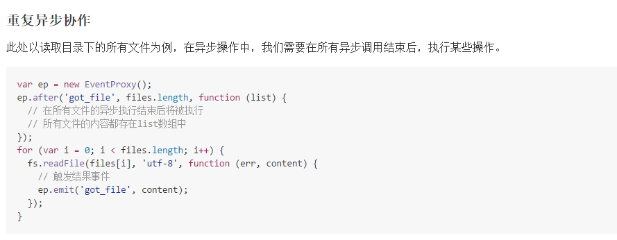
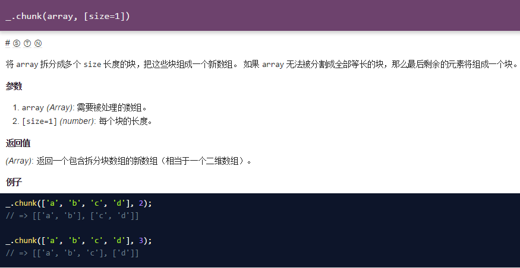
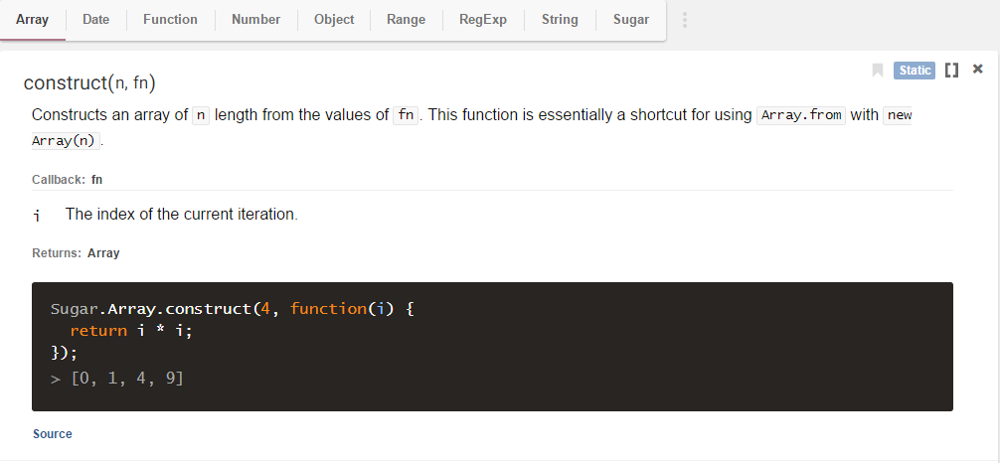

功能类
===

## underscore

> javascript基础功能扩展库



**Official：** 
- http://underscorejs.org/

**Features：**
- 100多个常用方法集
- 强大的集合操作

**Git:**
- https://github.com/jashkenas/underscore

**Demo:**
- http://underscorejs.org/

**Doc：**
- http://underscorejs.org/

**Example：**
```html

```

```javascript
var sum = _.reduce([1, 2, 3], function(memo, num){ 
	return memo + num; 
}, 0);
=> 6

```


## eventproxy

> javascript事件代理工具



**Official：** 
- http://underscorejs.org/

**Features：**
- 利用事件机制解耦复杂业务逻辑
- 移除被广为诟病的深度callback嵌套问题
- 将串行等待变成并行等待，提升多异步协作场景下的执行效率
- 友好的Error handling
- 无平台依赖，适合前后端，能用于浏览器和Node.js
- 兼容CMD，AMD以及CommonJS模块环境

**Git:**
- https://github.com/JacksonTian/eventproxy

**Demo:**
- https://github.com/JacksonTian/eventproxy

**Doc：**
- https://github.com/JacksonTian/eventproxy

**Example：**
```html

```

```javascript
var ep = EventProxy.create("template", "data", "l10n", function (template, data, l10n) {
  _.template(template, data, l10n);
});

$.get("template", function (template) {
  // something
  ep.emit("template", template);
});
$.get("data", function (data) {
  // something
  ep.emit("data", data);
});
$.get("l10n", function (l10n) {
  // something
  ep.emit("l10n", l10n);
});

```
## lodash

> javascript基础功能扩展库



**Official：** 
- https://lodash.com/

**Features：**
- 一致接口
- 模块化
- 高性能
- javaScript工具库

**Git:**
- https://github.com/lodash/lodash

**Demo:**
- http://lodashjs.com/docs/

**Doc：**
- http://lodashjs.com/docs/

**Example：**
```html

```

```javascript
_.chunk(['a', 'b', 'c', 'd'], 2);
// => [['a', 'b'], ['c', 'd']]

_.chunk(['a', 'b', 'c', 'd'], 3);
// => [['a', 'b', 'c'], ['d']]

```

## sugar

> 在原生对象上增加一些工具方法



**Official：** 
- https://sugarjs.com/

**Features：**
- 在原生对象上进行扩展，可能与未来浏览器产生一定的不兼容

**Git:**
- https://github.com/andrewplummer/Sugar/

**Demo:**
- https://sugarjs.com/docs/

**Doc：**
- https://sugarjs.com/docs/

**Example：**
```html

```

```javascript
Sugar.Array.construct(4, function(i) {
  return i * i;
});
[0, 1, 4, 9]

```


