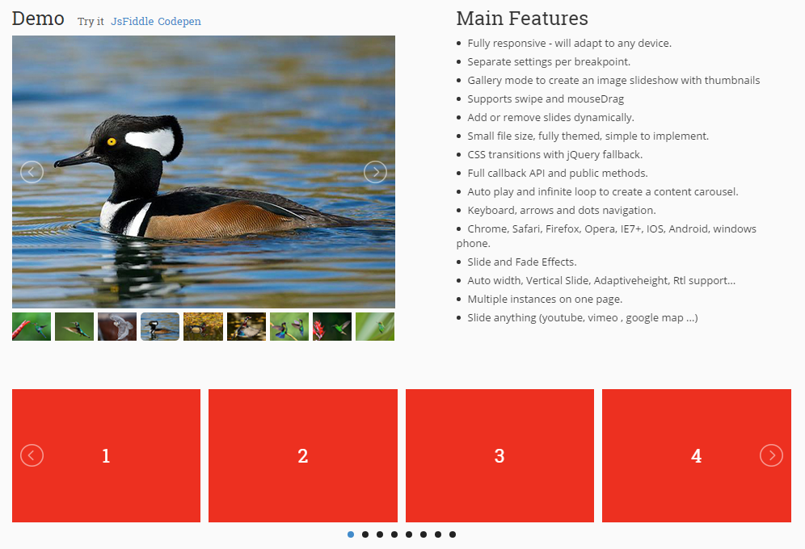

## lightSlider

> 轮播图插件，可多图展示。



**Official：** 
- http://sachinchoolur.github.io/lightslider/index.html

**Features：**
- 响应式，适配任何分辨率
- 支持相册模式展示
- 支持拖动和移动端触摸滑动
- 多样的API回调
- 支持键盘左右键操作
- 支持多图展示

**Git:**
- https://github.com/sachinchoolur/lightslider

**Demo:**
- http://sachinchoolur.github.io/lightslider/examples.html

**Doc：**
- http://sachinchoolur.github.io/lightslider/settings.html

**Example：**
```html
<ul id="lightSlider">
  <li>
      <h3>First Slide</h3>
      <p>Lorem ipsum Cupidatat quis pariatur anim.</p>
  </li>
  <li>
      <h3>Second Slide</h3>
      <p>Lorem ipsum Excepteur amet adipisicing fugiat velit nisi.</p>
  </li>
  ...
</ul>
```
```javascript
$("#lightSlider").lightSlider({
    item: 3,
    autoWidth: false,
    slideMove: 1, // slidemove will be 1 if loop is true
    slideMargin: 10,

    addClass: '',
    mode: "slide",
    useCSS: true,
    cssEasing: 'ease', //'cubic-bezier(0.25, 0, 0.25, 1)',//
    easing: 'linear', //'for jquery animation',////

    speed: 400, //ms'
    auto: false,
    loop: false,
    slideEndAnimation: true,
    pause: 2000,

    keyPress: false,
    controls: true,
    prevHtml: '',
    nextHtml: '',

    rtl:false,
    adaptiveHeight:false,

    vertical:false,
    verticalHeight:500,
    vThumbWidth:100,

    thumbItem:10,
    pager: true,
    gallery: false,
    galleryMargin: 5,
    thumbMargin: 5,
    currentPagerPosition: 'middle',

    enableTouch:true,
    enableDrag:true,
    freeMove:true,
    swipeThreshold: 40,

    responsive : [],

    onBeforeStart: function (el) {},
    onSliderLoad: function (el) {},
    onBeforeSlide: function (el) {},
    onAfterSlide: function (el) {},
    onBeforeNextSlide: function (el) {},
    onBeforePrevSlide: function (el) {}
});

```