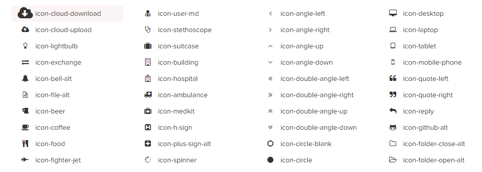

## Font Awesome

> 完美的图标字体，结合bootstrap使用效果更佳，也可以单独使用



**Official：** 
- http://www.bootcss.com/p/font-awesome/#

**Features：**
- 与bootstrap完美结合
- 大量可选用的图片
- 使用方便

**Git:**
- https://github.com/FortAwesome/Font-Awesome

**DEMO:**
- http://www.bootcss.com/p/font-awesome/#

**Doc：**
- http://www.bootcss.com/p/font-awesome/#

**Example：**
```html
<link rel="stylesheet" href="../css/bootstrap.min.css">
<link rel="stylesheet" href="../css/font-awesome.min.css">
<!--[if IE 7]>
<link rel="stylesheet" href="assets/css/font-awesome-ie7.min.css">
<![endif]-->

<p><i class="icon-camera-retro icon-large"></i> icon-camera-retro</p>
<p><i class="icon-camera-retro icon-2x"></i> icon-camera-retro</p>
<p><i class="icon-camera-retro icon-3x"></i> icon-camera-retro</p>
<p><i class="icon-camera-retro icon-4x"></i> icon-camera-retro</p>
```

```javascript

```

## 