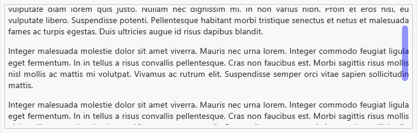

特效类
===

## slimScroll

> 用于改变滚动条样式的插件，基于jQuery，可以进行自定义



**Official：** 
- http://rocha.la/jQuery-slimScroll/

**Features：**
- 可以自定义滚动条的尺寸、颜色等
- 可以自定义滚动条的位置
- 拥有滚动条滚动的相关方法和事件

**Git:**
- https://github.com/yawetse/slimscroll

**Demo:**
- http://rocha.la/jQuery-slimScroll/

**Doc：**
- http://rocha.la/jQuery-slimScroll/

**Example：**
```html
<div class="some-content-related-div">
	<div id="inner-content-div">
		<p>Lorem ipsum dolor sit amet, consectetur .... snip</p>
	</div>
</div>
```

```javascript
$(selector).slimScroll({
    width: '300px',
    height: '500px',
    size: '10px',
    position: 'left',
    color: '#ffcc00',
    alwaysVisible: true,
    distance: '20px',
    start: $('#child_image_element'),
    railVisible: true,
    railColor: '#222',
    railOpacity: 0.3,
    wheelStep: 10,
    allowPageScroll: false,
    disableFadeOut: false
});

```