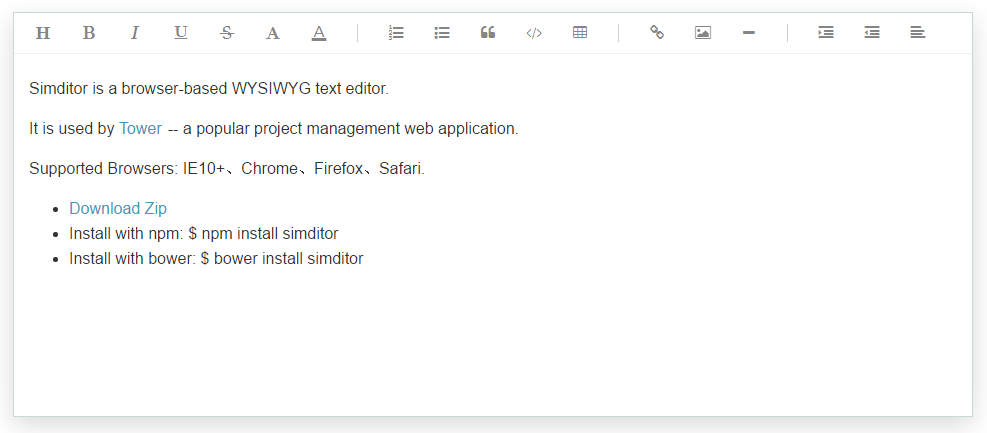

表单类
===

## Simditor

> 即时预览的Markdown编辑器。



**Official：** 
- http://simditor.tower.im/

**Features：**
- 支持分页、即时搜索、多行排序
- 支持多种形式数据源：**DOM元素**、**Javascript对象**、**ajax**、**json**，丰富的数据源选项
- 样式定制，自带样式或使用jQuery UI、Bootstrap等，可自定义
- 支持多种第三方扩展组件，自定义控件
- 可扩展的options，清晰的API
- 自定义行列功能性操作
- 快速的过滤选项开发

**Git:**
- https://github.com/mycolorway/simditor

**Demo:**
- http://simditor.tower.im/

**Doc：**
- http://simditor.tower.im/docs/doc-usage.html

**Example：**
```html
<textarea id="editor" placeholder="Balabala" autofocus></textarea>
```

```javascript
var editor = new Simditor({
  textarea: $('#editor')
  //optional options
});
```

## 